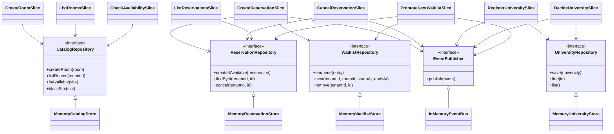

# Diagrama de Classes — Backend

```mermaid
classDiagram

direction TB

class CreateRoomSlice
class ListRoomsSlice
class CheckAvailabilitySlice

class CreateReservationSlice
class CancelReservationSlice
class ListReservationsSlice

class RegisterUniversitySlice
class DecideUniversitySlice

class PromoteNextWaitlistSlice


class CatalogRepository {
  <<interface>>
  +createRoom(room)
  +listRooms(tenantId)
  +isAvailable(slot)
  +blockSlot(slot)
}

class ReservationRepository {
  <<interface>>
  +createIfAvailable(reservation)
  +findById(tenantId, id)
  +cancel(tenantId, id)
}

class WaitlistRepository {
  <<interface>>
  +enqueue(entry)
  +next(tenantId, roomId, startsAt, endsAt)
  +remove(tenantId, id)
}

class UniversityRepository {
  <<interface>>
  +save(university)
  +find(id)
  +list()
}

class EventPublisher {
  <<interface>>
  +publish(event)
}


class MemoryCatalogStore
class MemoryReservationStore
class MemoryWaitlistStore
class MemoryUniversityStore
class InMemoryEventBus


CreateRoomSlice --> CatalogRepository
ListRoomsSlice --> CatalogRepository
CheckAvailabilitySlice --> CatalogRepository

CreateReservationSlice --> ReservationRepository
CancelReservationSlice --> ReservationRepository
ListReservationsSlice --> ReservationRepository

CreateReservationSlice --> WaitlistRepository
PromoteNextWaitlistSlice --> WaitlistRepository

RegisterUniversitySlice --> UniversityRepository
DecideUniversitySlice --> UniversityRepository

CreateReservationSlice --> EventPublisher
CancelReservationSlice --> EventPublisher
RegisterUniversitySlice --> EventPublisher
DecideUniversitySlice --> EventPublisher
PromoteNextWaitlistSlice --> EventPublisher

PromoteNextWaitlistSlice --> ReservationRepository


CatalogRepository <|-- MemoryCatalogStore
ReservationRepository <|-- MemoryReservationStore
WaitlistRepository <|-- MemoryWaitlistStore
UniversityRepository <|-- MemoryUniversityStore
EventPublisher <|-- InMemoryEventBus
```