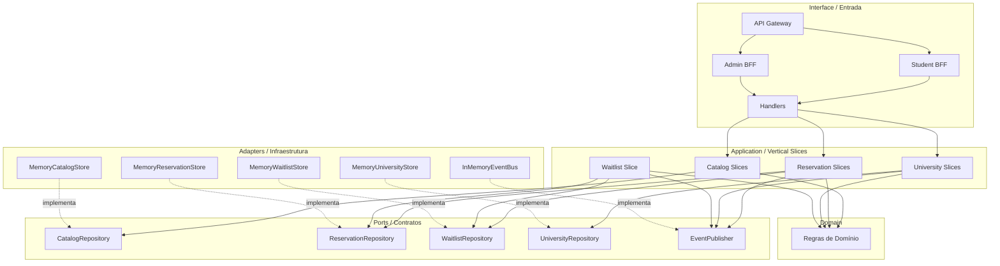

# Diagrama de Componentes — Backend

```mermaid
flowchart TB

subgraph Interface["Interface / Entrada"]
  Gateway["API Gateway"]
  StudentBFF["Student BFF"]
  AdminBFF["Admin BFF"]
  Handlers["Handlers"]
end

subgraph Application["Application / Vertical Slices"]
  Catalog["Catalog Slices"]
  Reservations["Reservation Slices"]
  Universities["University Slices"]
  Waitlist["Waitlist Slice"]
end

subgraph Domain["Domain"]
  DomainCore["Regras de Domínio"]
end

subgraph Ports["Ports / Contratos"]
  CatalogPort["CatalogRepository"]
  ReservationPort["ReservationRepository"]
  WaitlistPort["WaitlistRepository"]
  UniversityPort["UniversityRepository"]
  EventPort["EventPublisher"]
end

subgraph Adapters["Adapters / Infraestrutura"]
  CatalogAdapter["MemoryCatalogStore"]
  ReservationAdapter["MemoryReservationStore"]
  WaitlistAdapter["MemoryWaitlistStore"]
  UniversityAdapter["MemoryUniversityStore"]
  EventAdapter["InMemoryEventBus"]
end

Gateway --> StudentBFF
Gateway --> AdminBFF

StudentBFF --> Handlers
AdminBFF --> Handlers

Handlers --> Catalog
Handlers --> Reservations
Handlers --> Universities

Catalog --> DomainCore
Reservations --> DomainCore
Universities --> DomainCore
Waitlist --> DomainCore

Catalog --> CatalogPort
Reservations --> ReservationPort
Reservations --> WaitlistPort
Reservations --> EventPort
Universities --> UniversityPort
Universities --> EventPort
Waitlist --> ReservationPort
Waitlist --> WaitlistPort
Waitlist --> EventPort

CatalogAdapter -. implementa .-> CatalogPort
ReservationAdapter -. implementa .-> ReservationPort
WaitlistAdapter -. implementa .-> WaitlistPort
UniversityAdapter -. implementa .-> UniversityPort
EventAdapter -. implementa .-> EventPort
```